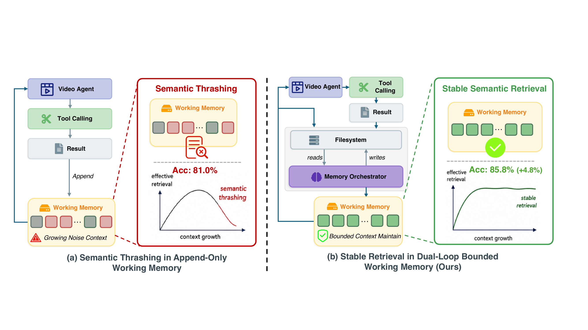

<div align="center">

# VideoLoop: Looped Working Memory Against Semantic Thrashing in Long-Form Video Agents

<a href="https://www.python.org/downloads/">
  
</a>
<a href="./LICENSE">
  
</a>


</div>

A native multimodal agent with LLM-orchestrated working memory for long-video
question answering. The outer loop reasons over the video and runs tools inside
a Docker sandbox; an inner loop (the *memory orchestrator*) rewrites a bounded
Markdown working memory from scratch after every step — keeping evidence dense
instead of letting an append-only context dilute it.

## Highlights ✨

<p align="center">
  
</p>

- 🧠 **Semantic thrashing.** We identify and formalize the core failure mode of
  long-video agents: as append-only memory grows, attention on early evidence
  collapses, so found evidence is effectively "lost" and re-searched.
- 🔁 **Dual-loop bounded memory.** An outer multimodal reasoning loop is paired
  with an inner orchestrator that retrieves from a sandbox filesystem and
  **rewrites** a bounded working memory each step, breaking the append-only bottleneck.
- 🏆 **State of the art.** With Gemini 3.1 Pro: **88.3%** VideoMME-Long,
  **89.1%** VideoMMMU, **80.9%** LongVideoBench-Long.
- 🔌 **Backbone-agnostic & training-free.** Consistent gains across Gemini 3.1 Pro,
  Gemini 3 Flash, and other frontier models.

## Table of Contents

- [Highlights ✨](#highlights-)
- [1. Results 📊](#1-results-)
- [2. Architecture 🧠](#2-architecture-)
- [3. Prerequisites 🧩](#3-prerequisites-)
- [4. Environment Setup 🛠️](#4-environment-setup-️)
- [5. Quick Start 🚀](#5-quick-start-)
  - [5.1 Prepare datasets](#51-prepare-datasets)
  - [5.2 Run a single question](#52-run-a-single-question)
  - [5.3 Run full evaluation](#53-run-full-evaluation)
  - [5.4 Results format](#54-results-format)
- [6. Configuration ⚙️](#6-configuration-️)
- [7. Repository Structure 🗂️](#7-repository-structure-️)
- [8. Tests 🧪](#8-tests-)
- [9. Acknowledgements 🙏](#9-acknowledgements-)
- [10. License ⚖️](#10-license-️)
- [11. Citation 📚](#11-citation-)

## 1. Results 📊

| Benchmark | Questions | Accuracy |
|---|---|---|
| VideoMME-Long | 900 | **88.3%** |
| VideoMMMU (3 tracks) | 804 | **89.1%** |
| LongVideoBench-Long | 564 | **80.9%** |

Gemini 3.1 Pro as both the policy model and the memory orchestrator (the paper's
default backbone). Cheaper backbones trade some accuracy for cost — e.g. Gemini 3
Flash reaches 85.7 / 88.7 / 73.8 on the same three benchmarks.

## 2. Architecture 🧠

```
┌──────────────────────────────────────────────────────────────────────────────────┐
│                                                                                  │
│                                DOCKER SANDBOX                                    │
│                                                                                  │
│    /videos/video.mp4        /outputs/frame_t*.jpg        /outputs/*.json         │
│                                                                                  │
│   ┌──────────────────────────────────────────────────────────────────────┐       │
│   │                                                                      │       │
│   │                      MAIN AGENT (multimodal LLM)                     │       │
│   │                         up to 50 iterations                          │       │
│   │                                                                      │       │
│   │   Reads: <MEMORY> + question images + injected frames + <TRANSCRIPT> │       │
│   │                                                                      │       │
│   │   Tools:                                                             │       │
│   │     execute_bash    — ffmpeg, python, any command in sandbox         │       │
│   │     analyze_frames  — agent sees frames directly, describes them     │       │
│   │     transcribe_audio — get video transcript                          │       │
│   │     submit_answer   — submit final answer                            │       │
│   │                                                                      │       │
│   └──────────────────────┬───────────────────────────────────────────────┘       │
│                          │                  ▲                                    │
│                          │ <TOOL_RESULT>    │ curated <MEMORY>                   │
│                          ▼                  │                                    │
│   ┌──────────────────────────────────────────────────────────────────────┐       │
│   │                                                                      │       │
│   │                      MEMORY ORCHESTRATOR                             │       │
│   │                      called after every tool                         │       │
│   │                                                                      │       │
│   │   Reads: working memory, <TOOL_RESULT>, manifest, available frames   │       │
│   │                                                                      │       │
│   │   Tools:                                                             │       │
│   │     inspect_frames — see actual frames from sandbox                  │       │
│   │     read_file      — access sandbox files                            │       │
│   │                                                                      │       │
│   │   Output: curated <MEMORY> (Markdown + images)                       │       │
│   │                                                                      │       │
│   └──────────────────────────────────────────────────────────────────────┘       │
│                                                                                  │
└──────────────────────────────────────────────────────────────────────────────────┘
```

## 3. Prerequisites 🧩

- **Python 3.10+** and **Docker** — the agent runs every tool inside a Docker sandbox.
- **NVIDIA GPU + drivers + the [NVIDIA Container Toolkit](https://docs.nvidia.com/datacenter/cloud-native/container-toolkit/install-guide.html).**
  The sandbox image is CUDA-based and `DockerRuntime` requests a GPU by default.
  On a host without a GPU, set `sandbox.gpu: false` in `configs/config.yaml` to
  run the sandbox CPU-only (frame extraction works on CPU; only WhisperX
  transcript generation genuinely needs a GPU).
- A **Gemini API key** (see [Environment Setup](#4-environment-setup-️)), and **`ffmpeg`**
  if you run the dataset prep / pre-compression scripts on the host.

## 4. Environment Setup 🛠️

**1. Python environment**

```bash
conda create -n videoloop python=3.10 -y
conda activate videoloop
pip install -e ".[dashboard,datasets]"
```

**2. Docker sandbox**

```bash
cd docker
./build.sh base    # First time: builds base image (~10-15 min)
./build.sh tools   # Builds tools layer on top (~5 sec)
```

Verify GPU access in the built image (skip if running CPU-only):

```bash
docker run --rm -it --gpus all video-understanding-sandbox:latest nvidia-smi
```

**3. API key**

Get a Gemini API key from [Google AI Studio](https://aistudio.google.com/apikey), then:

```bash
cp .env.example .env
# edit .env and set GEMINI_API_KEY
```

With no `api_base` configured, all components call the official Gemini API. Any
OpenAI-compatible endpoint can be substituted via `api_base` in
`configs/config.yaml` (or `MAIN_AGENT_API_BASE`).

## 5. Quick Start 🚀

### 5.1 Prepare datasets

The benchmark JSONs are rebuilt from the official HuggingFace releases — nothing
is redistributed in this repo. Both datasets are gated on the Hub, so first
authenticate (accept each dataset's terms on its HF page, then either run
`huggingface-cli login` or set `HF_TOKEN` in `.env`):

```bash
python scripts/prepare_videommmu.py --download-videos   # ~25GB of videos
python scripts/prepare_videomme.py  --download-videos   # Long split, several hundred GB
```

Both scripts work without `--download-videos` if you obtain the videos separately
(place them in `dataset/<benchmark>/videos/`). Video-MME is licensed for research
use only; VideoMMMU under its authors' license — see the respective HF dataset cards.

Transcripts: the pipeline reads cached WhisperX transcripts from
`dataset/<benchmark>/transcripts_whisperx/`. Generate them on a GPU machine with
`scripts/whisperx/whisperx_transcribe.py` — see
[scripts/whisperx/README.md](scripts/whisperx/README.md) for the Docker setup and
CLI options. Optional pre-compression for huge videos:
`python scripts/precompress_videos.py --help`.

### 5.2 Run a single question

```bash
python scripts/agent_cli.py single \
  --video dataset/videomme_long/videos/<id>.mp4 \
  --question "What color is the presenter's shirt?" \
  --options "A. Red,B. Blue,C. Green,D. White"
```

### 5.3 Run full evaluation

```bash
python scripts/agent_cli.py parallel-eval \
  --dataset dataset/videomme_long/videomme_long_full.json \
  --video-dir dataset/videomme_long/videos \
  --workers 32
```

A live dashboard starts automatically at `http://localhost:8080` (disable with
`--no-dashboard`; see [dashboard/README.md](dashboard/README.md)).

**Expected cost / runtime.** The full dual-loop + filesystem configuration uses
**~618K tokens per question** on VideoMME-Long (≈559K input / ≈59K output; frame
images dominate the input), per Table 3 of the paper. Token usage is set by the
architecture and is roughly backbone-independent; wall-clock and dollar cost scale
with the chosen model (`gemini-3.1-pro-preview` is slower and pricier than the
flash backbones) and the number of workers.

### 5.4 Results format

Each run writes `logs/parallel_eval_<run-id>.json`:

```jsonc
{
  "summary": {
    "total_videos": 300, "total_questions": 900,
    "answered": 895, "failed": 5, "correct": 790,
    "accuracy": 0.883, "elapsed_seconds": 12345.6,
    "rate_seconds_per_question": 13.8,
    "num_workers": 32, "model": "gemini-3.1-pro-preview"
  },
  "results": [
    {
      "question_id": "743-1", "video_id": "...",
      "question": "...", "options": ["A. ...", "B. ..."],
      "expected": "C", "predicted": "C", "correct": true,
      "reasoning": "...",            // model's submitted justification
      "elapsed_seconds": 41.2,
      "trajectory": [                 // ordered agent steps
        {"step_type": "tool_use", "content": {...}, "timestamp": 0.0}
      ],
      "token_usage": {"total": {...}, "by_agent": {...}},
      "error": null                   // non-null string if the question failed
    }
  ]
}
```

The dashboard renders this live during the run; `failed` questions have
`predicted: null` and a populated `error`.

## 6. Configuration ⚙️

`configs/config.yaml` ships with the configuration used for the paper results
(native multimodal agent, orchestrated memory, `analyze_frames`-only visual
analysis, Gemini 3.1 Pro for both loops). Point `CONFIG_FILE` at another file in
`configs/` to experiment. Prompts live in `configs/prompts.yaml` (`PROMPTS_FILE`
to override).

## 7. Repository Structure 🗂️

```
videoloop/
├── video_agent/            # Core package
│   ├── agent.py            # Outer multimodal reasoning loop
│   ├── memory/             # Inner-loop memory orchestrator
│   ├── tools.py            # Tool schemas
│   ├── tool_handlers.py    # Tool implementations
│   ├── llm_api.py          # Gemini-native + OpenAI-compatible transport
│   ├── api_calls.py        # Provider dispatch + normalization
│   ├── parallel_eval.py    # Multi-worker evaluation
│   └── docker_runtime.py   # Sandbox lifecycle
├── scripts/
│   ├── agent_cli.py        # CLI: `single` / `parallel-eval`
│   ├── prepare_videomme.py # Rebuild VideoMME-Long JSON from HF
│   ├── prepare_videommmu.py# Rebuild VideoMMMU JSON from HF
│   └── whisperx/           # WhisperX transcript generation (Docker)
├── configs/                # config.yaml + prompts.yaml
├── dashboard/              # Live evaluation dashboard (FastAPI + static)
├── docker/                 # Sandbox images (base + tools)
├── tests/                  # Unit tests
└── assets/                 # Figures
```

| Path | What it does |
|---|---|
| `video_agent/agent.py` | Outer agent loop: reasoning, tool calls, frame analysis |
| `video_agent/memory/orchestrator.py` | Inner loop: rewrites bounded working memory each step |
| `video_agent/parallel_eval.py` | Parallel benchmark evaluation with live dashboard |
| `scripts/agent_cli.py` | Entry point for single questions and full eval |
| `configs/config.yaml` | Paper configuration (model, memory, tool whitelist) |
| `dashboard/` | Real-time + archived run viewer |

## 8. Tests 🧪

```bash
pip install -e ".[dev]"
pytest tests/
```

## 9. Acknowledgements 🙏

This work builds on the [Video-MME](https://huggingface.co/datasets/lmms-lab/Video-MME),
[VideoMMMU](https://huggingface.co/datasets/lmms-lab/VideoMMMU), and
[LongVideoBench](https://huggingface.co/datasets/longvideobench/LongVideoBench)
benchmarks, and on [WhisperX](https://github.com/m-bain/whisperX) for transcripts.
We thank the authors of these resources.

## 10. License ⚖️

[Apache-2.0](LICENSE). Benchmark data remains under the respective benchmark
authors' licenses.

## 11. Citation 📚

```bibtex
@article{xu2026videoloop,
  title   = {VideoLoop: Looped Working Memory Against Semantic Thrashing in Long-Form Video Agents},
  author  = {Xu, Jianming and Huang, Jinfa and Lin, Jingyang and Yang, Zhengyuan and Luo, Jiebo},
  year    = {2026},
}
```
