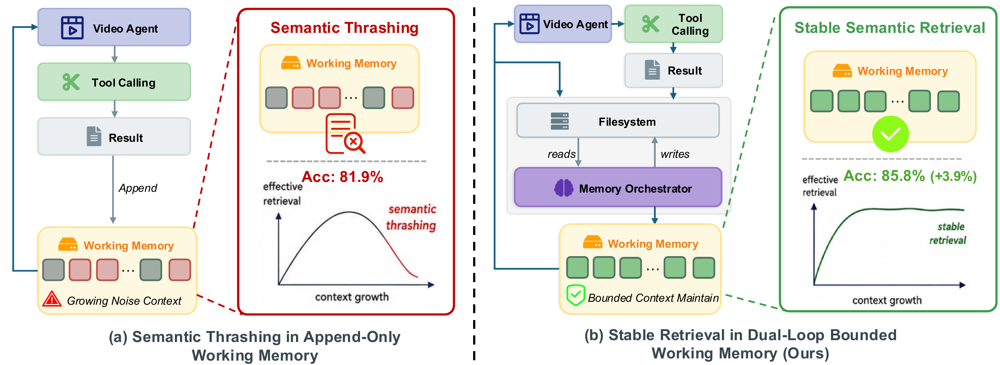
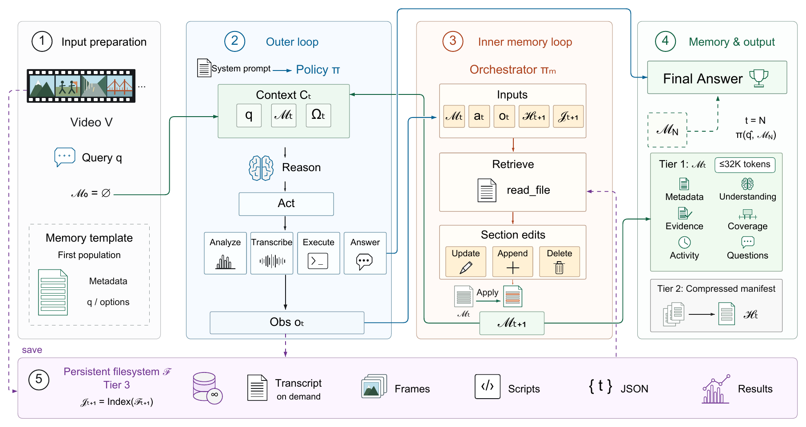

<h1 align="center">VideoLoop: Looped Working Memory Against Semantic Thrashing in Long-Form Video Agents</h1>

<p align="center">
  <a href="https://arxiv.org/abs/2609.38119">
    
  </a>
  <a href="https://www.python.org/downloads/">
    
  </a>
  <a href="./LICENSE">
    
  </a>
</p>

<p align="center">
  <a href="#Highlights">Highlights</a> ·
  <a href="#installation">Installation</a> ·
  <a href="#quick-start">Quick Start</a> ·
  <a href="#configuration">Configuration</a> ·
  <a href="#repository-structure">Repository Structure</a> ·
  <a href="#citation">Citation</a>
</p>

VideoLoop is a training-free agent for long-form video question answering. Most agents append every tool output to their context until key evidence is buried, which we call *semantic thrashing*. VideoLoop instead adds an inner *memory orchestrator* that rewrites a small, bounded working memory after every step.

<br>
<details open><summary>💡 We also have other long video understanding projects that may interest you ✨. </summary><p>

> [**Video-RAG: Visually-aligned Retrieval-Augmented Long Video Comprehension**](https://arxiv.org/abs/2411.13093) <br>
> Yongdong Luo, Xiawu Zheng and Jinfa Huang etc. <br>
> [](https://github.com/Leon1207/Video-RAG-master)  [](https://github.com/Leon1207/Video-RAG-master) [](https://arxiv.org/abs/2411.13093) <br>
>
> [**VideoSeek: Long-Horizon Video Agent with Tool-Guided Seeking**](https://arxiv.org/abs/2603.20185) <br>
> Jingyang Lin, Jialian Wu and Jiang Liu etc. <br>
> [](https://github.com/jylins/videoseek)  [](https://github.com/jylins/videoseek) [](https://arxiv.org/abs/2603.20185) <br>
>
> [**Unleashing Hour-Scale Video Training for Long Video-Language Understanding**](https://arxiv.org/abs/2506.05332) <br>
> Jingyang Lin, Jialian Wu and Ximeng Sun etc. <br>
> [](https://github.com/jylins/hourllava)  [](https://github.com/jylins/hourllava) [](https://arxiv.org/abs/2506.05332) <br>
> </p></details>


<a id="Highlights"></a>
## Highlights ✨

<p align="center">

</p>

| Direction | Description |
| --- | --- |
| Semantic Thrashing | Append-only memory can add evidence but never remove noise, so long-video agents lose track of what they have already found. |
| Dual-Loop Memory | An inner orchestrator rewrites a bounded working memory after every step, backed by a sandbox filesystem that keeps every artifact. |
| Plug-and-Play | No training; works with different LVLM backbones. With Gemini 3.1 Pro: 88.3% on VideoMME-Long, 88.8% on VideoMMMU, 80.9% on LongVideoBench-Long. |

<details>
<summary><b>How it works</b></summary>

<p align="center">

</p>

- **Outer loop**: the agent sees the question, the working memory, and its last few turns, and calls `analyze_frames`, `transcribe_audio`, `execute_bash`, or `submit_answer`.
- **Inner loop**: after every tool call, the memory orchestrator reads the result, retrieves relevant files from the sandbox (`read_file`, `inspect_frames`), and updates the six sections of the working memory.
- **Sandbox filesystem**: every frame, analysis, transcript, and script stays on disk, so nothing has to be kept in context to be found again later.

</details>

<details>
<summary><b>Main results</b></summary>

| Method | VideoMME-Long | VideoMMMU | LongVideoBench-Long |
| --- | :---: | :---: | :---: |
| Gemini 3 Flash | 80.7 | 83.6 | 67.9 |
| + VideoLoop | 85.8 | 87.7 | 73.8 |
| Gemini 3.1 Pro | 83.8 | 84.6 | 77.7 |
| **+ VideoLoop** | **88.3** | **88.8** | **80.9** |

Accuracy (%). See the paper for the full comparison and analysis.

</details>


<a id="installation"></a>
## 1. Installation 🛠️

You need `Python 3.10+`, `Docker`, an NVIDIA GPU with the [NVIDIA Container Toolkit](https://docs.nvidia.com/datacenter/cloud-native/container-toolkit/install-guide.html), and a [Gemini API key](https://aistudio.google.com/apikey).

```bash
# 1. Python environment
conda create -n videoloop python=3.10 -y
conda activate videoloop
pip install -e ".[dashboard,datasets]"

# 2. Docker sandbox (the first build takes ~10-15 min)
cd docker
./build.sh base
./build.sh tools
cd ..

# 3. API key
cp .env.example .env    # then set GEMINI_API_KEY in .env
```

- No GPU? Set `sandbox.gpu: false` in `configs/config.yaml`. Frame extraction works on CPU; only WhisperX transcript generation needs a GPU.
- Not using Gemini? Any OpenAI-compatible endpoint works via `api_base` in `configs/config.yaml` (or `MAIN_AGENT_API_BASE`).


<a id="quick-start"></a>
## 2. Quick Start 🚀

### 2.1 Ask a Question About a Video

```bash
python scripts/agent_cli.py single \
  --video path/to/video.mp4 \
  --question "What color is the presenter's shirt?" \
  --options "A. Red,B. Blue,C. Green,D. White"
```

If the video has no cached transcript, the sandbox transcribes it with Whisper when the agent asks for one.

### 2.2 Evaluate on Benchmarks

Download the benchmarks from HuggingFace. Both are gated, so first accept their terms on the dataset pages and run `huggingface-cli login` (or set `HF_TOKEN` in `.env`):

```bash
python scripts/prepare_videomme.py  --download-videos   # VideoMME long split, several hundred GB
python scripts/prepare_videommmu.py --download-videos   # VideoMMMU, ~25GB
```

Then run the evaluation:

```bash
python scripts/agent_cli.py parallel-eval \
  --dataset dataset/videomme_long/videomme_long_full.json \
  --video-dir dataset/videomme_long/videos \
  --workers 32
```

A live dashboard opens at `http://localhost:8080` (turn it off with `--no-dashboard`), and results are written to `logs/parallel_eval_<run-id>.json`. For reference, a VideoMME-Long question takes about 618K tokens with Gemini 3 Flash.

Optional:

- Pre-compute transcripts on a GPU machine with `scripts/whisperx/whisperx_transcribe.py`; they are cached in `dataset/<benchmark>/transcripts_whisperx/` (see [scripts/whisperx/README.md](scripts/whisperx/README.md)).
- Shrink very large videos with `python scripts/precompress_videos.py --help`.

<details>
<summary><b>Output format</b></summary>

```jsonc
{
  "summary": {
    "total_videos": 300, "total_questions": 900,
    "answered": 895, "failed": 5, "correct": 790,
    "accuracy": 0.883, "elapsed_seconds": 12345.6,
    "rate_seconds_per_question": 13.8,
    "num_workers": 32, "model": "gemini-3.1-pro-preview"
  },
  "results": [
    {
      "question_id": "743-1", "video_id": "...",
      "question": "...", "options": ["A. ...", "B. ..."],
      "expected": "C", "predicted": "C", "correct": true,
      "reasoning": "...",            // model's submitted justification
      "elapsed_seconds": 41.2,
      "trajectory": [                 // ordered agent steps
        {"step_type": "tool_use", "content": {...}, "timestamp": 0.0}
      ],
      "token_usage": {"total": {...}, "by_agent": {...}},
      "error": null                   // non-null string if the question failed
    }
  ]
}
```

Failed questions have `predicted: null` and a populated `error`.

</details>


<a id="configuration"></a>
## 3. Configuration ⚙️

`configs/config.yaml` is the configuration used for the paper results (Gemini 3.1 Pro for both loops). The settings you are most likely to change:

| Setting | Default | What it controls |
| --- | :---: | --- |
| `main_agent.model` | `gemini-3.1-pro-preview` | Model for the outer loop |
| `memory.summarizer_model` | `gemini-3.1-pro-preview` | Model for the memory orchestrator |
| `--workers` | 4 | Parallel evaluation workers |
| `--max-iterations` | 50 | Maximum agent steps per question |
| `memory.max_key_frames` | 6 | Key frames kept in working memory |

Use `CONFIG_FILE` to point at another config in `configs/`, and `PROMPTS_FILE` to override `configs/prompts.yaml`.


<a id="repository-structure"></a>
## 4. Repository Structure 🗂️

```text
videoloop/
├── video_agent/            # Core package
│   ├── agent.py            # Outer multimodal reasoning loop
│   ├── memory/             # Inner-loop memory orchestrator
│   ├── tools.py            # Tool schemas
│   ├── tool_handlers.py    # Tool implementations
│   ├── parallel_eval.py    # Multi-worker evaluation
│   └── docker_runtime.py   # Sandbox lifecycle
├── scripts/
│   ├── agent_cli.py        # CLI: `single` / `parallel-eval`
│   ├── prepare_videomme.py # Build the VideoMME-Long JSON from HF
│   ├── prepare_videommmu.py# Build the VideoMMMU JSON from HF
│   └── whisperx/           # Transcript generation
├── configs/                # config.yaml + prompts.yaml
├── dashboard/              # Live evaluation dashboard
├── docker/                 # Sandbox images
└── tests/                  # Unit tests (pip install -e ".[dev]" && pytest tests/)
```


## 5. Acknowledgements 🙏

This work builds on the [Video-MME](https://huggingface.co/datasets/lmms-lab/Video-MME), [VideoMMMU](https://huggingface.co/datasets/lmms-lab/VideoMMMU), and [LongVideoBench](https://huggingface.co/datasets/longvideobench/LongVideoBench) benchmarks, and on [WhisperX](https://github.com/m-bain/whisperX) for transcripts. We thank the authors of these resources.

## 6. License ⚖️

This repository is released under `Apache-2.0`. Benchmark data remains under the respective benchmark authors' licenses.

<a id="citation"></a>
## 7. Citation 📚

If you use this repository, please cite the corresponding paper:

```bibtex
@article{huang2026videoloop,
  title={VideoLoop: Looped Working Memory Against Semantic Thrashing in Long-Form Video Agents},
  author={Huang, Jinfa and Xu, Jianming and Lin, Jingyang and Yang, Zhengyuan and Luo, Jiebo},
  journal={arXiv preprint arXiv:2609.38119},
  year={2026}
}
```
